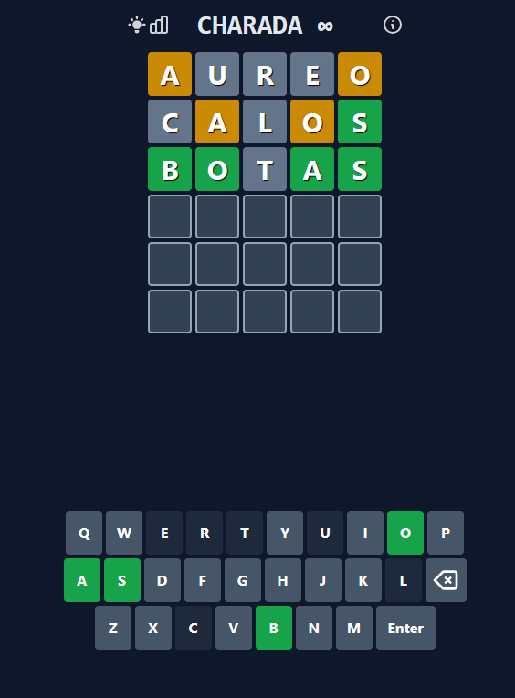

<div align="center" id="top"> 
  
</div>

<h1 align="center">CharadaSolver</h1>


<h4 align="center"> 
	🌐 Projeto Concluído 🌐
</h4> 

<hr>

<p align="center">
  <a href="#dart-sobre">Sobre</a> &#xa0; | &#xa0; 
  <a href="#rocket-tecnologias">Tecnologias</a> &#xa0; | &#xa0;
  <a href="#white_check_mark-pré-requisitos">Pré requisitos</a> &#xa0; | &#xa0;
  <a href="#checkered_flag-começando">Começando</a> &#xa0; | &#xa0;
  <a href="https://github.com/gustaoliv" target="_blank">Autor</a>
</p>

<br>

## :dart: Sobre ##

Um dos meus jogos preferidos dos últimos tempos foi o [Termo](https://term.ooo/), basicamente é um jogo em que uma vez por dia libera 1 palavra de 5 letras e  você tem 6 chances para adivinhar qual a palavra, e a cada rodada o jogo te indica as letras que você acertou, errou a posição ou não existem na palavra.

Uma variação bem legal desse jogo é o [Charada](https://charada.app/), que é uma versão infinita do Termo, ou seja, não tem o limite de 1 palavra por dia.

Por isso, tive a ideia de criar esse projeto que é um resolvedor para o Charada, que utiliza uma base de palavras do português e realiza uma serie de manipulações de acordo as letras certas ou erradas para adivinhar qual a palavra.

<div align="center" id="top"> 
  
</div>


## :rocket: Tecnologias ##

As seguintes ferramentas foram usadas na construção do projeto:

- [Python](https://www.python.org/)
- [Selenium](https://selenium-python.readthedocs.io/)


## :white_check_mark: Pré requisitos ##

Antes de começar :checkered_flag:, você precisa ter o [Git](https://git-scm.com), o [Python](https://www.python.org/)


## :checkered_flag: Começando ##

```bash
# Clone este repositório
$ git clone https://github.com/gustaoliv/CharadaSolver.git

# Entre na pasta
$ cd CharadaSolver

# Criação da Virtualenv
$ python -m venv .venv

# Ativação da Virtualenv
$ ./.venv/Scripts/activate 
# ou
$ .\.venv\Scripts\activate

# Instalação das dependências
$ pip install -r requirements.txt

# Iniciando aplicação
$ python main.py
```

Feito com :heart: por <a href="https://github.com/gustaoliv" target="_blank">Gustavo Oliveira</a>

&#xa0;

<a href="#top">Voltar para o topo</a>
